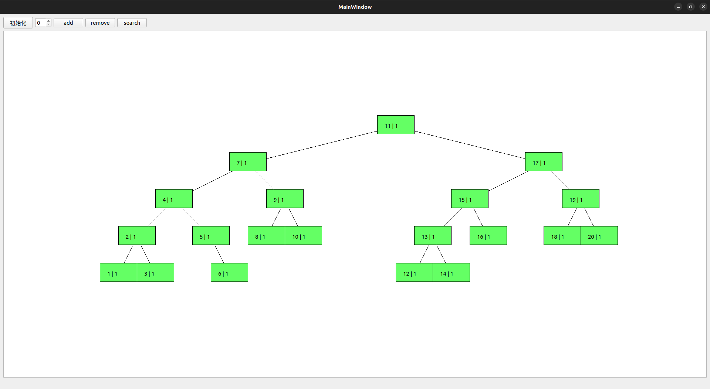

# 设计思路

初步思路：将代码用命名空间封装，预计后期每个算法可视化都是不同的模块，
每个模块重新设计实现思路。节点设计以"非必要不继承"原则，绘制相关尽量
只使用QT封装好的组件，虽然会降低代码复用率，但能减少耦合，使后续各个
模块相对独立(~~自己设计越少屎山越少~~)

可视化对象：avl平衡树

基础avl树数据：key值，cnt计数，height树高，lchild、rchild左右孩子指针，
pos绘图所需该节点二维坐标。

绘图设计：设置单位长度R，横坐标计算方式为：左右子树在原有坐标基础上加减R，
pos记录逻辑坐标(起始坐标为{0, 0})。因此需要维护最值，min_x和max_x，实际绘
图时在逻辑坐标基础上添加一定的偏移量即可。初步将偏移量设置为-min_x + 常量
(100);纵坐标计算方式：在父节点基础上加2R。

具体绘制：每个节点使用rectItem组件进行绘制，并添加子组件textItem展示文本
信息；若存在孩子节点，则用lLine、rLine组件设置坐标连线，并使其z轴小于rectItem。


# 遇到的问题

## 删除节点莫名奇妙崩溃

在构造函数中textItem组件设置了rectItem作为父容器，
父组件释放时会释放其子容器，
释放内存循序不对，导致同一内存重复释放：

```c++
AvlNode::~AvlNode() {
    delete rectItem;
    delete textItem;
    if (lLine) delete lLine;
    if (rLine) delete rLine;
}
```

修改后

```c++
AvlNode::~AvlNode() {
    // textItem会随着父组件rectItem一起释放
    delete rectItem;
    if (lLine) delete lLine;
    if (rLine) delete rLine;
}
```


## 槽函数匿名函数的使用

槽函数匿名函数为什么只能用=捕获scene?引用捕获则程序异常


## 事件延时

查询操作将需要将遍历到的节点延时变色，直接sleep会阻塞主线程，
使用QEventLoop进入事件循环则不会阻塞主线程。

```c++
QTimer timer;
QEventLoop loop;

void sleep_for(int ms) {
    timer.start(ms);    // 开始计时
    loop.exec();        // 进入事件循环
}

...
// 设置槽函数，触发超时函数后退出事件循环
connect(&timer, &QTimer::timeout, &loop, &QEventLoop::quit);
...
```
直接使用全局变量会出现错误，虽然不会影响程序运行:
QEventLoop::exec: instance 0x5bd4efda3810 has already called exec()

设置成QEventLoop* loop，然后在构造函数里实例化，虽然没有报错了，
但感觉有坑，记录一下。



